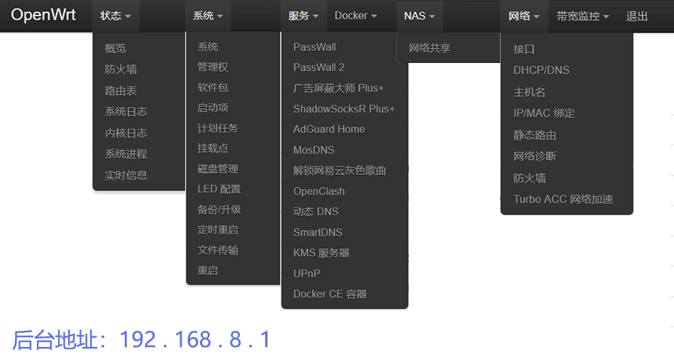
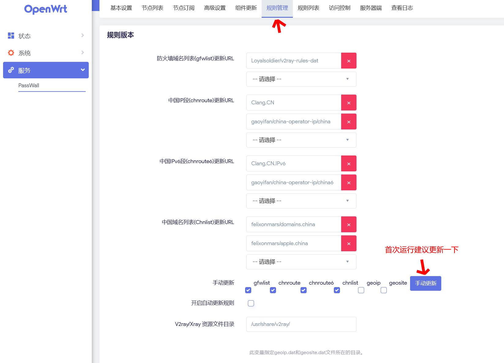

# 仅供学习、查阅资料使用。本仓库仅仅会发布rockchip平台机型的固件，有部分在，但是有些机型没有，后期会慢慢收集
**运行编译时间：rockchip 每周三** 

rockchip平台：ariaboard_photonicat、ezpro_mrkaio-m68s、ezpro_mrkaio-m68s、fastrhino_r66s、nanopi-r2c、nanopi-r2s、nanopi-r3s、nanopi-r4s、nanopi-r4se、nanopi-r5c、nanopi-r5s、station-p2、hinlink_opc-h28k、hinlink_opc-h66k、hinlink_opc-h68k、hinlink_opc-h69k、lyt_t68m、radxa_e20c、xunlong_orangepi-5-plus、xunlong_orangepi-r1-plus、xunlong_orangepi-r1-plus-lts、widora_mangopi-m28k、widora_mangopi-m28k-pro 
仓库发布仅有以上机型，如果没有你想要的，请等待更新，谢谢！！！ 

默认ip地址：192.168.8.1 默认开启 smartdns（海外端口6553） Openclash已下载好clash内核（mtk平台不下载meta core） 
 
 
## passwall + smartdns（海外端口6553）使用配置。
 
 

**English** | [中文](https://p3terx.com/archives/build-openwrt-with-github-actions.html)

# Actions-OpenWrt

A template for building OpenWrt with GitHub Actions

## Usage

- Click the [Use this template](https://github.com/P3TERX/Actions-OpenWrt/generate) button to create a new repository.
- Generate `.config` files using [Lean's OpenWrt](https://github.com/coolsnowwolf/lede) source code. ( You can change it through environment variables in the workflow file. )
- Push `.config` file to the GitHub repository.
- Select `Build OpenWrt` on the Actions page.
- Click the `Run workflow` button.
- When the build is complete, click the `Artifacts` button in the upper right corner of the Actions page to download the binaries.

## Tips

- It may take a long time to create a `.config` file and build the OpenWrt firmware. Thus, before create repository to build your own firmware, you may check out if others have already built it which meet your needs by simply [search `Actions-Openwrt` in GitHub](https://github.com/search?q=Actions-openwrt).
- Add some meta info of your built firmware (such as firmware architecture and installed packages) to your repository introduction, this will save others' time.

## Credits

- [Microsoft Azure](https://azure.microsoft.com)
- [GitHub Actions](https://github.com/features/actions)
- [OpenWrt](https://github.com/openwrt/openwrt)
- [Lean's OpenWrt](https://github.com/coolsnowwolf/lede)
- [tmate](https://github.com/tmate-io/tmate)
- [mxschmitt/action-tmate](https://github.com/mxschmitt/action-tmate)
- [csexton/debugger-action](https://github.com/csexton/debugger-action)
- [Cowtransfer](https://cowtransfer.com)
- [WeTransfer](https://wetransfer.com/)
- [Mikubill/transfer](https://github.com/Mikubill/transfer)
- [actions/upload-artifact](https://github.com/actions/upload-artifact)
- [softprops/action-gh-release](https://github.com/softprops/action-gh-release)
- [Mattraks/delete-workflow-runs](https://github.com/Mattraks/delete-workflow-runs)
- [dev-drprasad/delete-older-releases](https://github.com/dev-drprasad/delete-older-releases)
- [peter-evans/repository-dispatch](https://github.com/peter-evans/repository-dispatch)

## License

[MIT](https://github.com/P3TERX/Actions-OpenWrt/blob/main/LICENSE) © [**P3TERX**](https://p3terx.com)
