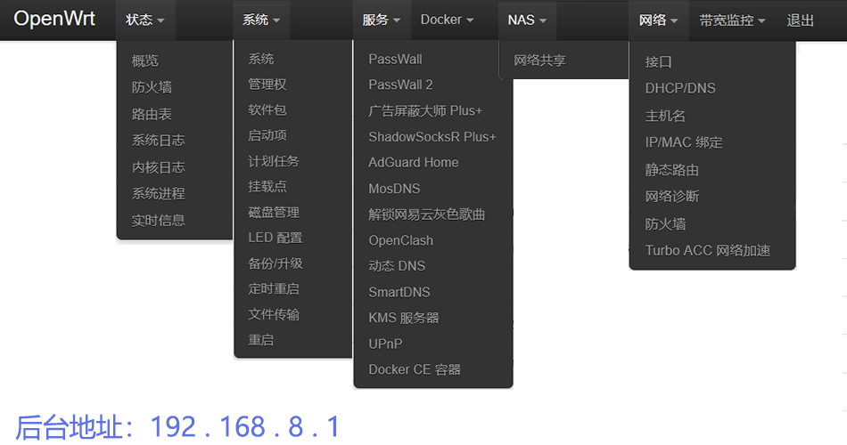
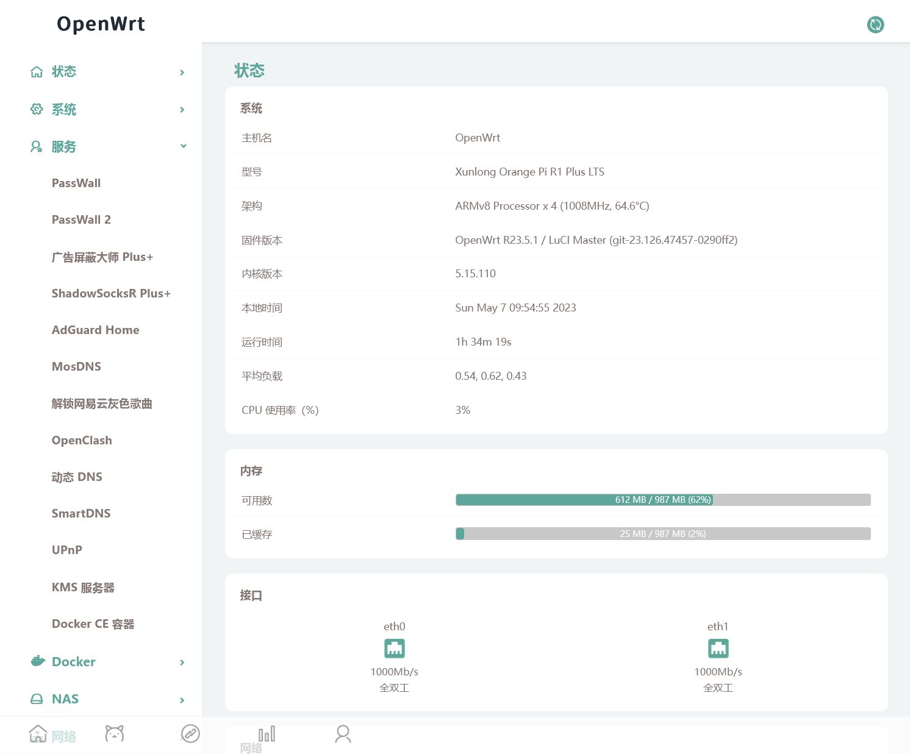
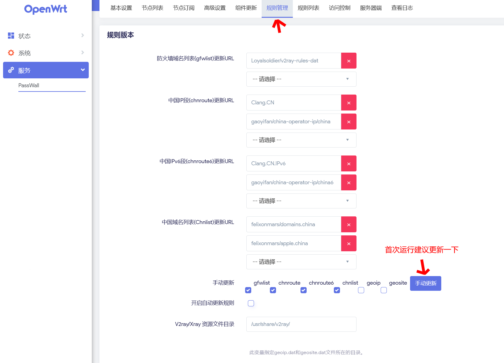

## License

[MIT](https://github.com/P3TERX/Actions-OpenWrt/blob/main/LICENSE) © [**P3TERX**](https://p3terx.com)   
[**作者源仓库 Actions-OpenWrt**](https://github.com/P3TERX/Actions-OpenWrt)

# 仅供学习、查阅资料使用。
！！！把旧的编译办法放在 step-by-step-run 分支，需要的自己克隆切换 
**目前采用overlay分区编译，非必要 不要编译太多插件** 
.github/workflows_  工作流文件（自动化编译最主要的文件），如果无法编译可以看描述文件内容自己更改 
configs_____________ 配置文件夹（主要修改这个），Target-* 修改平台型号。Packages-* 是插件编译。 
files/etc____________ 固件内置配置文件夹，用于覆盖使用（一般不会改，我只是用来预先放smartdns配置文件） 
patchs______________我自己放的补丁文件夹，现在基本用不上了 
scripts______________ 脚本文件夹，添加 插件克隆 和 实现想要的操作 

## ip地址：192.168.8.1 
**运行编译时间：周一 Allwinner、周三 Rockchip、周四 mediatek & mt7621、周五 x86** 
smartdns（海外端口6553） Openclash已下载好clash?内核 

 
x86 平台：不用说了吧~ 
allwinner 平台：请看 releases 
mediatek 平台：还是看 releases 
rockchip 平台：太多了 去看看 releases 
 
## passwall + smartdns（海外端口6553）使用配置。
 
 

**English** | [中文](https://p3terx.com/archives/build-openwrt-with-github-actions.html)

# Actions-OpenWrt

A template for building OpenWrt with GitHub Actions

## Credits

- [Microsoft Azure](https://azure.microsoft.com)
- [GitHub Actions](https://github.com/features/actions)
- [OpenWrt](https://github.com/openwrt/openwrt)
- [Lean's OpenWrt](https://github.com/coolsnowwolf/lede)
- [tmate](https://github.com/tmate-io/tmate)
- [mxschmitt/action-tmate](https://github.com/mxschmitt/action-tmate)
- [csexton/debugger-action](https://github.com/csexton/debugger-action)
- [Cowtransfer](https://cowtransfer.com)
- [WeTransfer](https://wetransfer.com/)
- [Mikubill/transfer](https://github.com/Mikubill/transfer)
- [actions/upload-artifact](https://github.com/actions/upload-artifact)
- [softprops/action-gh-release](https://github.com/softprops/action-gh-release)
- [Mattraks/delete-workflow-runs](https://github.com/Mattraks/delete-workflow-runs)
- [dev-drprasad/delete-older-releases](https://github.com/dev-drprasad/delete-older-releases)
- [peter-evans/repository-dispatch](https://github.com/peter-evans/repository-dispatch)

#### Related Repositories（部分代码灵感来源，感谢~）

- [VIKINGYFY/OpenWRT-CI](https://github.com/VIKINGYFY/OpenWRT-CI)
- [smallprogram/OpenWrtAction](https://github.com/smallprogram/OpenWrtAction)
- [zzcabc/OpenWrt_Action](https://github.com/zzcabc/OpenWrt_Action)
- [WYC-2020/Actions-OpenWrt](https://github.com/WYC-2020/Actions-OpenWrt)
- [mingxiaoyu/R1-Plus-LTS](https://github.com/mingxiaoyu/R1-Plus-LTS)
- [SuLingGG/OpenWrt-Rpi](https://github.com/SuLingGG/OpenWrt-Rpi)

